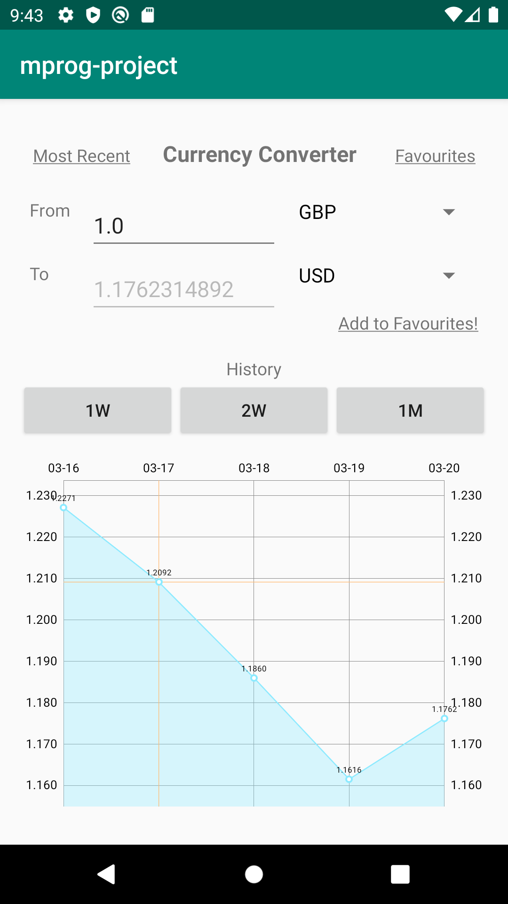
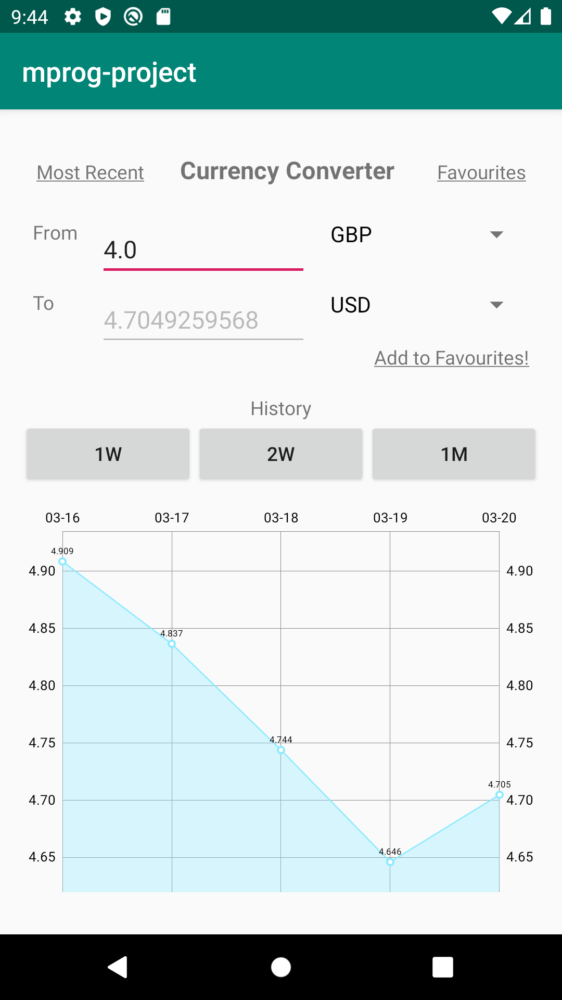
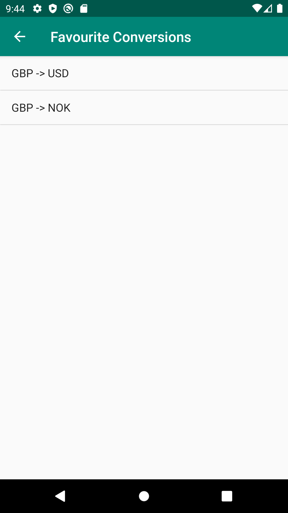
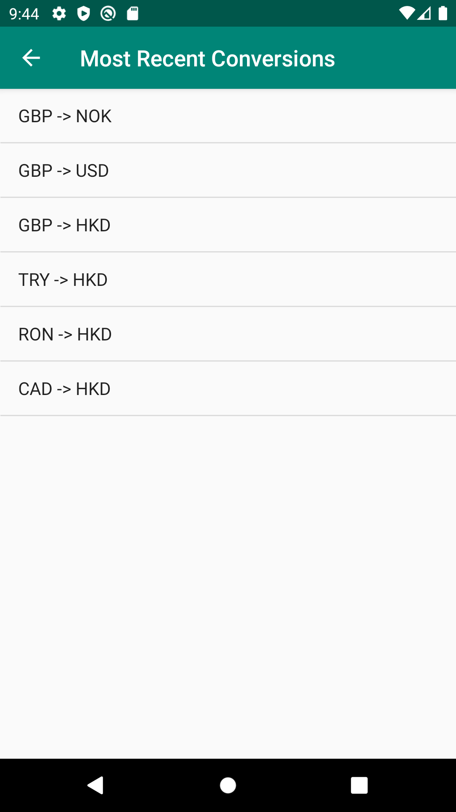

# Project Currency Converter

My project is a simple currency converter application.  

The application contains the following features:
1. Conversion of an arbitrary amount in one currency to another, this is the main feature of the application. The exchange rates are fetched on demand from an open API hosted by exchangeratesapi.io. 
2. Possibility to display the last 30 days of historical exchange data between two currencies. The historical data is clearly displayed as a line chart. The historical data is also fetched from an open API provided by https://exchangeratesapi.io/.
3. Add favorite conversions. Favorites are stored to persistant storage. 
4. Display most recent conversions. The most recent conversions are also stored to persistant storage; thus, the data will survive 

# Data

My application uses data provided by https://exchangeratesapi.io/. The application uses three different APIs:

1. Fetch a list all supported currencies.
2. Fetch historical exchange data between two currencies
3. Get todays exchange rates between two currencies.

All APIs return data in JSON format. My application communicates with the API using an HTTP client called Volley (https://github.com/google/volley).

My application also saves some data (favourite conversions and history) locally on the user's device. The data is stored using the shared prefernces API and the data is saved as JSON. Before the data is saved to persistant storage, I convert the java objects which are used internally by my application to their JSON representation using GSON (https://github.com/google/gson).

# Walkthrough:

The main screen can be devided into two parts. 

The bottom half of the main screen contains the line chart that display historical exchange data. The line charts are created with the help of an Android library called MPAndroidChart (https://github.com/PhilJay/MPAndroidChart). By default, 7 days of historical data is displayed. However, it is possible to also display 14 days or 1 month by pushing the buttons "2W" and "1M", respectively.  

The upper half contains two input fields and two dropdown menus. The dropdown menus contains a list of the availible currencies and two input fields where the user can enter a amount he or she wishes to convert to the other currency.

Only one of the two input fields is possible to modify, the top one. When the user modifies the top input field, the bottom input field's value will automatically update with the new conversion value. 

It is also possible for users to save his/her favourite conversions. This is done by pushing the "Add to favourites!" label. All favourites can be displayed by pushing the "Favourites" label in the top right corner. Once the favourite list is showing, the user can either navigate back to the main screen by pushing the arrow in the top left corner or push one of the rows in the list view. If the user pushes one of the rows, then the main view will be updated with the conversion the user pushed. 

Every time the user enters a new conversion combination, the history is saved in the application. It is possible to display the last 10 conversions made by a user by pushing the "Most Recent" label in the top left corner of the main view. Again, it is possible to display a conversion in the history list by pushing one of the rows.

